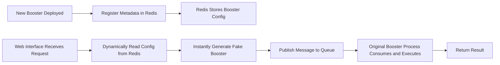

# Why funboost.faas Supports Hot-Reloading Functions

## Core Question

When a new `@boost`-decorated consumer function is deployed, the **web service requires no restart** — it can immediately call that function via the HTTP interface and retrieve results. How is this hot-reload capability implemented?

## Analysis of the Underlying Mechanism

### 1. Architecture Overview



### 2. Key Mechanism: Redis-Based Metadata Registration

When a `@boost`-decorated function starts consuming, it automatically serializes and writes the `BoosterParams` configuration into Redis:

| Redis Key | Stored Content |
|-----------|----------|
| `funboost_all_queue_names` | Set of all queue names |
| `funboost.project_name:{project}` | Queue names grouped by project |
| `funboost_queue__consumer_parmas` | Full BoosterParams configuration (JSON) for each queue |

**Example core configuration** (stored in Redis):

```json
{
  "queue_name": "test_funboost_faas_queue",
  "broker_kind": "REDIS",
  "auto_generate_info": {
    "final_func_input_params_info": {
      "func_name": "add",
      "must_arg_name_list": ["x", "y"],
      "optional_arg_name_list": []
    }
  }
}
```

### 3. Core Implementation of Hot Reload

The core of hot reload is in the [SingleQueueConusmerParamsGetter._gen_booster_by_redis_meta_info](file:///d:/codes/funboost/funboost/core/active_cousumer_info_getter.py#L565-L617) method:

```python
def _gen_booster_by_redis_meta_info(self) -> Booster:
    # 1. Read config from Redis (cached, expires in 60 seconds)
    booster_params = self.get_one_queue_params_use_cache()

    # 2. Generate a fake function based on the function's input parameter info
    redis_final_func_input_params_info = booster_params['auto_generate_info']['final_func_input_params_info']
    fake_fun = FakeFunGenerator.gen_fake_fun_by_params(redis_final_func_input_params_info)

    # 3. Instantly create a Fake Booster (used only for publishing messages)
    booster_params['consuming_function'] = fake_fun
    booster_params['is_fake_booster'] = True

    booster = Booster(BoosterParams(**booster_params))(fake_fun)
    return booster
```

### 4. Call Chain of the Publish Interface

Core logic of the [publish_msg](file:///d:/codes/funboost/funboost/faas/fastapi_adapter.py#L354-L407) interface:

```python
@fastapi_router.post("/publish")
async def publish_msg(msg_item: MsgItem):
    # Core: dynamically retrieve config from Redis by queue_name and generate a publisher
    publisher = SingleQueueConusmerParamsGetter(msg_item.queue_name).gen_publisher_for_faas()

    # Publish message
    async_result = await publisher.aio_publish(msg_item.msg_body)
```

## Key Design of Hot Reload

### Why Hot Reload Is Possible

| Design Point | Explanation |
|---------|------|
| **Separation of metadata and execution** | The web layer only needs to know how to publish messages; it does not need the actual consumer function code |
| **Redis as a registry** | Boosters register automatically on startup; the web layer discovers them dynamically |
| **Fake Booster mechanism** | A fake function is generated from the function signature info, used only for message publishing and parameter validation |
| **Queue name discovery** | All available queues are dynamically retrieved from the `funboost_all_queue_names` set |

### Comparison with Traditional Web Development

| Comparison | Traditional Web | funboost.faas |
|--------|---------|---------------|
| Adding a new feature | Requires new interface code + service restart | Only deploy the Booster; no changes needed to the web layer |
| Interface discovery | Must be documented manually | Automatically retrieved from Redis via function signature |
| Parameter validation | Must be written manually | Automatic based on `final_func_input_params_info` |

## Usage Example

### 1. Consumer Side (Independently Deployed)

```python
# task_funs_dir/add.py
from funboost import boost, BoosterParams

@boost(BoosterParams(
    queue_name="test_funboost_faas_queue",
    is_send_consumer_heartbeat_to_redis=True,  # heartbeat reporting must be enabled
    is_using_rpc_mode=True,  # supports RPC mode to retrieve results
))
def add(x: int, y: int = 10):
    return x + y
```

### 2. Web Side (No Code Changes Required)

```python
# example_fastapi_faas.py
from fastapi import FastAPI
from funboost.faas import fastapi_router

app = FastAPI()
app.include_router(fastapi_router)  # just this one line
```

### 3. Calling a Newly Deployed Function

```bash
# Immediately callable after the new Booster is deployed
curl -X POST http://127.0.0.1:8000/funboost/publish \
  -H "Content-Type: application/json" \
  -d '{"queue_name": "test_funboost_faas_queue", "msg_body": {"x": 10, "y": 20}, "need_result": true}'
```

## Summary

The core principle behind funboost.faas hot reload is:

> **Store Booster configuration metadata in Redis. The web interface dynamically reads the configuration from Redis by queue_name, instantly generates a Fake Booster to publish the message, without needing to hold the actual consumer function code.**

This design achieves **configuration-driven** rather than **code-driven** behavior, turning the web service into a universal message-publishing gateway, with the actual business logic executed by independently deployed Booster processes.
